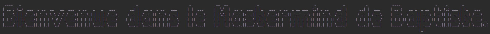
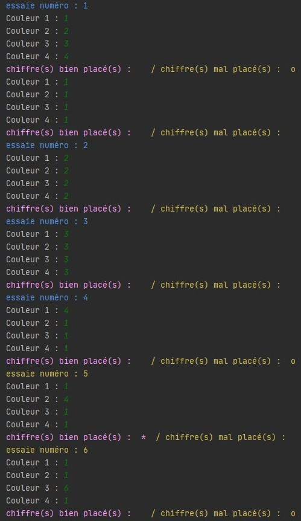
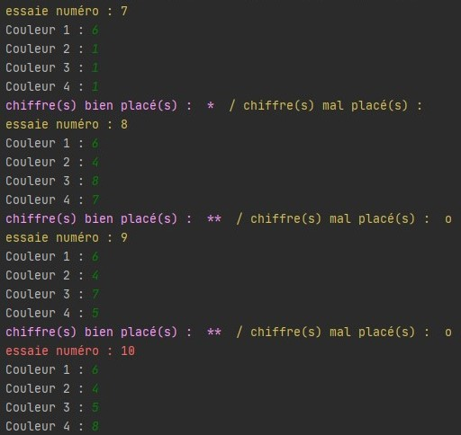
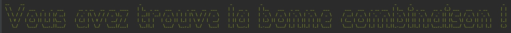
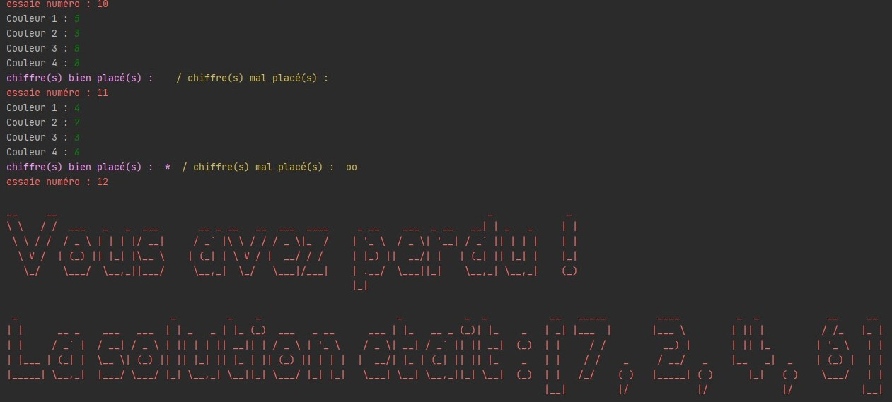

# Mastermind

### How and why:

This game was create for my 2nd years in hightschool it's was a Project for my NSI (digital and computer science) specialty

### HOW THE GAME WORKS:

Before starting, the players decide which one will come up with the first secret combination. Once chosen, the player stands on the side of the rotating end of the board and proceeds to place their colored pawns to create their combination, obviously hidden from the other.

In order to guess what the face of this combination is, the player opposite will gradually make proposals, inserting pawns in the four holes on the line on the board just in front of him. It is next to impossible except by pure chance or cheating to achieve the combination on the first try. The player who has hidden the pawns will indicate his success rate as follows:

He places the same number of black pawns as the number of well-placed colored pawns, and he materializes the badly placed pawns, but of the correct color, with white pawns. The player who has to guess must use tactics, given the information transmitted by his opponent using the black and white pawns to progress gradually towards the solution. He is entitled to 12 proposals to succeed in finding the combination.

### THE WINNER IS :

The player who has to find the combination has 12 suggestions for doing so. If he fails, whoever put on the combination wins the round. If he wins, it’s his turn to set up his pawns in an order and color to be found by the other.

# About my game:

The style of my game is command line, there is no GUI.

## Images : 

#### Welcome !

#### The Game

#### The Game Over

